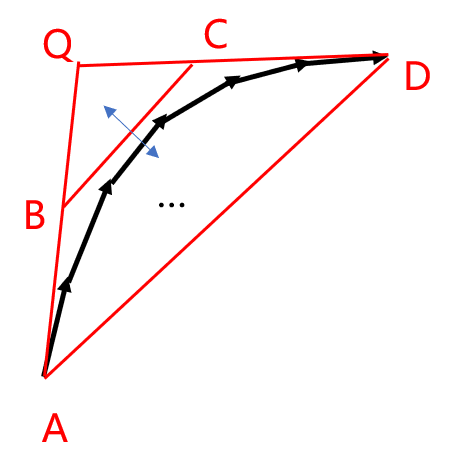
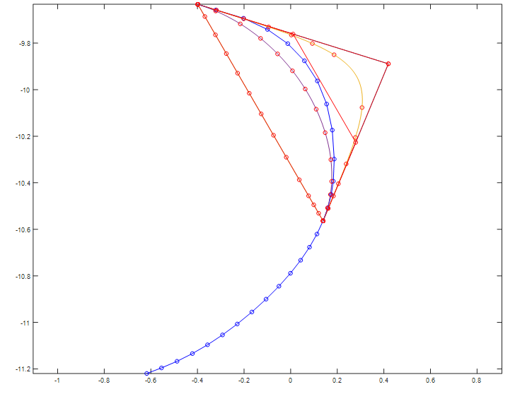

# TxtToAi

将点集进行贝塞尔曲线化，转成矢量图

## 编译&运行

- g++ *.cc  -o main -std=c++11   编译
- ./main || ./main readfilename writefilename
- readfilename可以txt文件，示例点集如original.txt所示，每一个实体以0 0结尾，或者为dxf文件，polyline和circle均可读出
- writefilename为输出文件，为ai，即有直线和贝塞尔（三阶）曲线组成。

## 点集转曲线方法

1. 点集疏化，将一条直线上的点去掉
2. 找到连续曲线点集
3. 将曲线点集以拐角90度分段分别进行贝塞尔化
4. 通过三角行和二分法求对应的贝塞尔控制点。
5. 将结果以.ai文件输出

